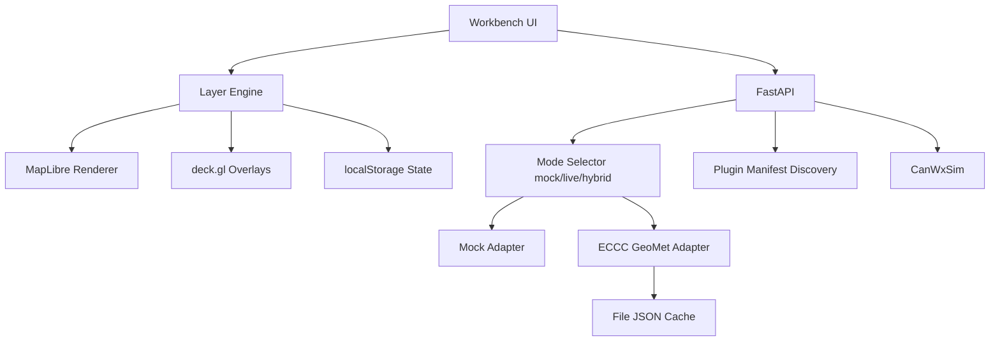

# Architecture

CanWxLab is split into bounded contexts so ingestion, rendering, simulation, and verification can evolve independently.

## Bounded Contexts

- **Web Workbench**: React/Vite + MapLibre + deck.gl UI
- **Layer Engine**: frontend layer registry, runtime controls, animation state, persistence
- **Data Ingestion**: source adapters for mock and ECCC GeoMet
- **Source Health + Cache**: explicit status model and stale/fallback cache behavior
- **Plugin Catalog**: manifest-only discovery and status normalization
- **Simulation Engine**: Rust `canwxsim` crate and CLI
- **Run Manager**: simulation run API contracts
- **Verification Lab**: metric summaries and diagnostics

## Phase 2 Workbench Flow

## Backend Boundaries

Route handlers do not perform raw source HTTP logic directly.

- routes: request validation + typed responses
- adapters: fetch + normalize + fallback decisions
- cache client: deterministic URL+params keying + stale-on-failure policy
- plugin discovery: parse/validate manifests only, no execution

## Frontend Boundaries

- React components consume normalized API contracts.
- Schema normalization stays in backend adapters.
- Layer logic stays in `apps/web/src/layers/*`.
- Renderer-specific behavior is isolated under `layers/renderers/*`.

## Reliability Rules

- Mock/offline mode must remain fully usable.
- Live mode must not silently swap to mock.
- Hybrid fallback must be explicit.
- Experimental and simulation products remain clearly labeled.
- Tests must not require internet.

## Renderer Direction

- Current default: MapLibre + deck.gl
- Optional globe preview: MapLibre projection toggle when supported
- CesiumJS: deferred optional renderer path after renderer abstraction hardening
